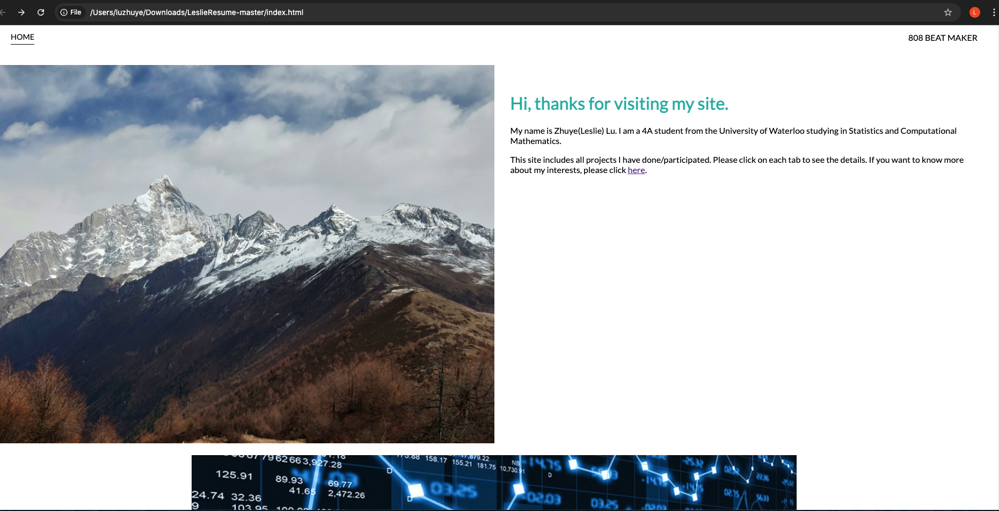
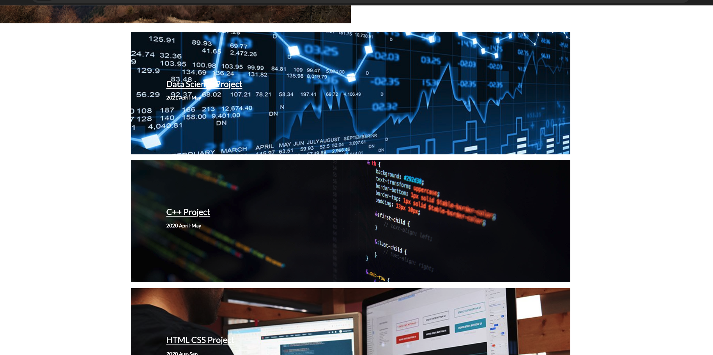
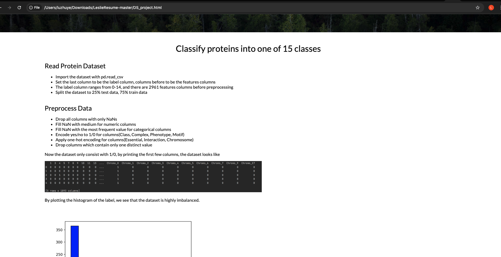
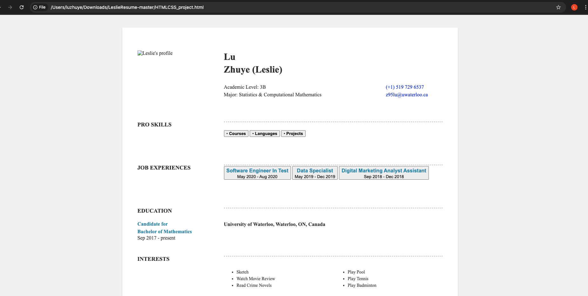

# Leslie-UnderGraduate4A-Resume

This repository presented a webpage version of my undergraduate 4A term resume. The webpage was coded in HTML, CSS and JavaScript

## A Quick Start

Please download the file package and open ```index.html``` with any browser.

## A Brief Overview







